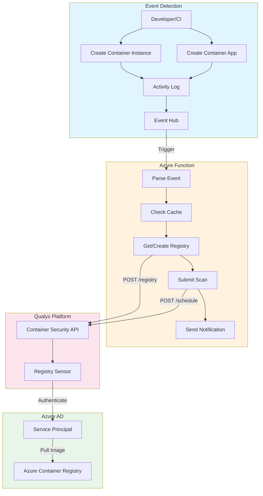
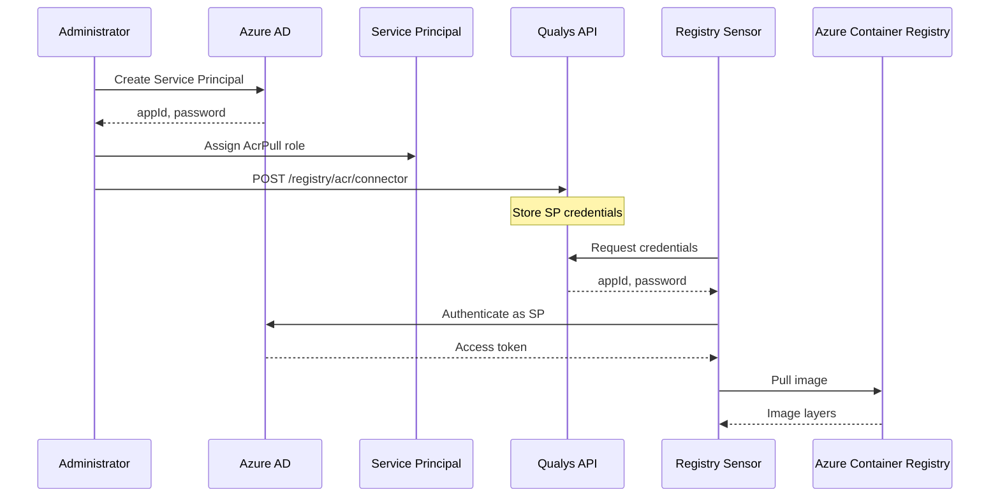
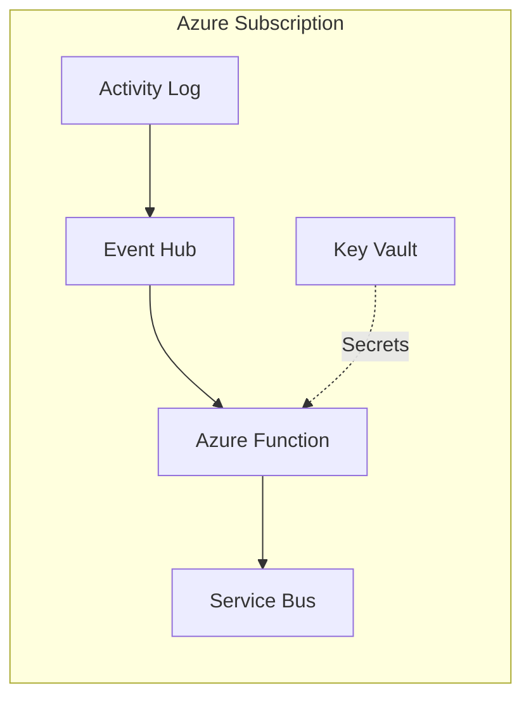
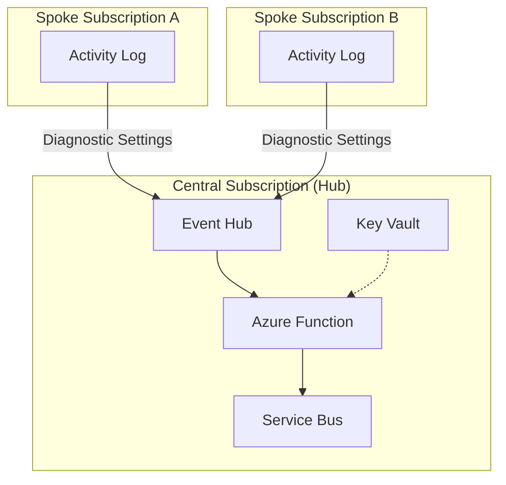
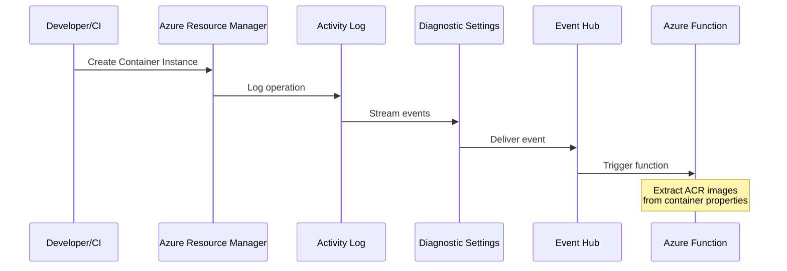
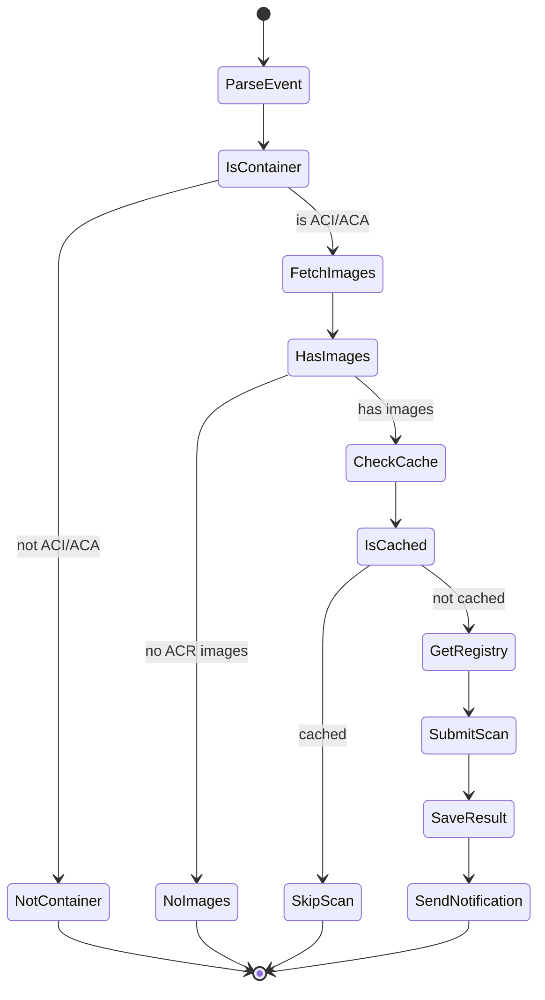

# Event-Driven Container Scanning for Azure ACI and ACA with Qualys

Every container deployed to Azure is a potential attack surface. Base images ship with unpatched OS packages. Application dependencies carry known CVEs. The window between deployment and vulnerability discovery represents active risk exposure.

This post presents an event-driven architecture that triggers Qualys vulnerability scans automatically when Azure Container Instances (ACI) or Azure Container Apps (ACA) are deployed. Azure Functions process Activity Log events. Service Principal authentication provides ACR access without static credentials stored in Qualys. The architecture scales from single-subscription deployments to enterprise-wide coverage across Azure tenants.

## The Container Security Challenge

Traditional container scanning approaches create coverage gaps:

- **Scheduled scans**: Images deployed between scan windows run unanalyzed in production
- **Manual triggers**: Developers forget, skip, or disable scanning to meet deadlines
- **Build-time only**: Base image vulnerabilities discovered post-deployment require re-scanning
- **Static credentials**: ACR access keys require rotation and create secret sprawl

The solution is event-driven scanning with Service Principal authentication. Every ACI/ACA deployment triggers analysis automatically. Credentials are managed through Azure AD. No gaps in coverage.

## Architecture Overview



When a developer creates an ACI container group or deploys a Container App, the Activity Log captures the management event. Diagnostic settings stream events to Event Hub. An Azure Function processes the event, extracts ACR image references, and calls the Qualys Container Security API to submit an on-demand scan. The Qualys Registry Sensor authenticates using the Service Principal to pull images from ACR. Critical findings trigger Service Bus notifications.

## Service Principal Authentication

The architecture uses Azure AD Service Principal for ACR access:



During deployment, the administrator creates a Service Principal with AcrPull role and registers it with Qualys via the ACR connector API. When the Registry Sensor needs to pull an image, it authenticates using the Service Principal credentials and receives an access token.

This approach provides several advantages:

- **Centralized authentication**: Single Service Principal covers all ACRs
- **Role-based access**: AcrPull provides read-only access to images
- **Audit trail**: Azure AD logs all authentication events
- **Credential management**: Service Principal secrets can be rotated without redeploying

## Deployment Options

The architecture supports two deployment patterns, scaling from single-subscription to enterprise-wide coverage.

### Single Subscription

The simplest deployment covers one Azure subscription:



```bash
export QUALYS_API_TOKEN="your-bearer-token"
export ACR_APPLICATION_ID="your-sp-app-id"
export ACR_CLIENT_SECRET="your-sp-secret"

./deploy.sh
```

The deployment script creates all required resources: Event Hub for Activity Log streaming, Azure Function for event processing, Service Bus for notifications, and Key Vault for secrets.

### Multi-Subscription (Hub-Spoke)

Enterprise deployments use a hub-spoke pattern:



```bash
# Deploy hub in central subscription
export CENTRAL_SUBSCRIPTION_ID="hub-subscription-id"
./deploy-multi.sh

# Add spoke subscriptions
export SPOKE_SUBSCRIPTION_ID="spoke-subscription-id"
./add-spoke.sh
```

Each spoke subscription forwards Activity Log events to the central Event Hub via diagnostic settings. The central Azure Function processes all events and has Reader access to spoke subscriptions for fetching container metadata.

## Event Detection

The detection chain transforms Azure management activity into function invocations:



### Activity Log Configuration

Diagnostic settings capture Administrative category events:

```bicep
resource activityLogDiagnostics 'Microsoft.Insights/diagnosticSettings@2021-05-01-preview' = {
  name: 'activity-log-to-eventhub'
  scope: subscription()
  properties: {
    eventHubAuthorizationRuleId: eventHubAuthRuleId
    eventHubName: 'activity-log'
    logs: [
      { category: 'Administrative', enabled: true }
    ]
  }
}
```

### Event Patterns

Two event patterns capture container deployments:

| Operation | Resource Type |
|-----------|---------------|
| `Microsoft.ContainerInstance/containerGroups/write` | ACI container group |
| `Microsoft.App/containerApps/write` | Container App |

The function filters for successful write operations and extracts container image references from the resource metadata.

## Event Processing

The Azure Function processes Activity Log events and orchestrates the scanning workflow:



### Image Extraction

The function fetches container details via Azure Management SDK:

```python
def fetch_container_images(subscription_id, resource_group, container_name, container_type):
    credential = DefaultAzureCredential()

    if container_type == 'ACI':
        client = ContainerInstanceManagementClient(credential, subscription_id)
        container_group = client.container_groups.get(resource_group, container_name)
        return [c.image for c in container_group.containers]

    elif container_type == 'ACA':
        client = ContainerAppsAPIClient(credential, subscription_id)
        container_app = client.container_apps.get(resource_group, container_name)
        return [c.image for c in container_app.template.containers]
```

### Cache Check

Table Storage tracks recent scans with configurable TTL (default 24 hours):

```python
def is_recently_scanned(image, hours=24):
    partition_key = sanitize_name(image)
    cutoff_time = datetime.utcnow() - timedelta(hours=hours)

    query = f"PartitionKey eq '{partition_key}' and Timestamp ge datetime'{cutoff_time.isoformat()}'"
    entities = table_client.query_entities(query_filter=query)

    return len(list(entities)) > 0
```

### Registry Management

The function creates ACR registries in Qualys automatically using the connector:

```python
def get_or_create_registry(gateway_url, token, registry_name, acr_login_server,
                           connector_name, application_id, client_secret):
    registry_uri = f"https://{acr_login_server}"

    uuid = get_registry_uuid(gateway_url, token, registry_uri)
    if uuid:
        return {'registry_uuid': uuid, 'created': False}

    ensure_acr_connector(gateway_url, token, connector_name, application_id, client_secret)
    result = create_acr_registry(gateway_url, token, registry_name, acr_login_server, connector_name)

    return {'registry_uuid': result['registry_uuid'], 'created': True}
```

Registry naming follows the convention `acr-{registry_name}`, where `registry_name` is derived from the ACR login server (e.g., `acr-myregistry` for `myregistry.azurecr.io`).

### Scan Submission

The function submits on-demand scans to the Qualys Container Security API:

```python
payload = {
    "filters": [{
        "repoTags": [{
            "repo": repo_name,
            "tag": tag_filter
        }]
    }],
    "name": f"ACR-{repo_name}-{datetime.now().strftime('%Y%m%d%H%M%S')}",
    "onDemand": True,
    "forceScan": True,
    "registryType": "ACR"
}

response = requests.post(
    f"{gateway_url}/csapi/v1.3/registry/{registry_uuid}/schedule",
    json=payload,
    headers=headers
)
```

### Notifications

Service Bus delivers scan notifications using Managed Identity:

```python
def send_notification(message):
    credential = DefaultAzureCredential()
    with ServiceBusClient(namespace, credential) as client:
        with client.get_queue_sender(queue_name) as sender:
            sender.send_messages(ServiceBusMessage(json.dumps(message)))
```

Notification messages include:
- `type`: Event type (e.g., `scan_submitted`)
- `image`: Full image reference
- `container_type`: ACI or ACA
- `resource_id`: Azure resource ID
- `scan_id`: Qualys scan identifier

## Qualys API Reference

| Endpoint | Purpose |
|----------|---------|
| `GET /csapi/v1.3/registry/acr/connectors` | List ACR connectors |
| `POST /csapi/v1.3/registry/acr/connector` | Create ACR connector with Service Principal |
| `GET /csapi/v1.3/registry` | Find registry by URI or name |
| `POST /csapi/v1.3/registry` | Create ACR registry using connector |
| `POST /csapi/v1.3/registry/{uuid}/schedule` | Submit on-demand scan |
| `GET /csapi/v1.3/images/{imageId}` | Check scan status |
| `GET /csapi/v1.3/images/{imageId}/vuln` | Get vulnerability details |

## Prerequisites

Before deploying, ensure you have:

1. **Qualys Registry Sensor** deployed and connected to the Qualys platform.

2. **Service Principal** with AcrPull role on target ACRs:
   ```bash
   az ad sp create-for-rbac \
     --name qualys-acr-scanner \
     --role AcrPull \
     --scopes /subscriptions/$(az account show --query id -o tsv)
   ```

3. **Qualys API Token** with Container Security permissions.

4. **Azure CLI** and **Azure Functions Core Tools** installed.

## Security Considerations

The architecture implements defense in depth following Azure security best practices:

### Managed Identity Everywhere

All Azure service authentication uses Managed Identity with RBAC—no connection strings or SAS tokens:

| Resource | Role | Purpose |
|----------|------|---------|
| Storage Account | Storage Blob Data Owner | Scan results storage |
| Storage Account | Storage Table Data Contributor | Cache metadata |
| Event Hub | Azure Event Hubs Data Receiver | Function trigger |
| Service Bus | Azure Service Bus Data Sender | Notifications |
| Key Vault | Key Vault Secrets User | Access secrets |

### Custom Role for Minimal Permissions

Instead of the broad `Reader` role, a custom role grants only the permissions needed:

```bicep
permissions: [
  {
    actions: [
      'Microsoft.ContainerInstance/containerGroups/read'
      'Microsoft.App/containerApps/read'
      'Microsoft.Resources/subscriptions/resourceGroups/read'
    ]
  }
]
```

### Disabled Legacy Authentication

Local/SAS authentication is disabled on all services:

- **Storage**: `allowSharedKeyAccess: false`
- **Event Hub**: `disableLocalAuth: true`
- **Service Bus**: `disableLocalAuth: true`

### Secrets Management

Only two secrets exist, both stored in Key Vault with RBAC access:
- Qualys API Token
- Service Principal Secret (for ACR connector)

The Function App accesses these via Key Vault references—secrets never appear in app settings or logs.

## Cost Estimation

| Component | Cost Driver | Estimate |
|-----------|-------------|----------|
| Azure Functions (Consumption) | Executions | ~$3-8/month |
| Event Hub (Basic) | Throughput units | ~$11/month |
| Service Bus (Basic) | Messages | ~$0.05/month |
| Storage Account | Blob + Table | ~$1-2/month |
| Key Vault | Operations | ~$0.50/month |
| Application Insights | Ingestion | ~$0-2/month |

For 100 container deployments per day, expect approximately $15-25/month. Qualys licensing is separate.

## Troubleshooting

**Function not triggering**: Verify Activity Log diagnostic settings are streaming to Event Hub. Check Event Hub metrics in Azure Portal.

**ACR connector creation failed**: Ensure the Service Principal exists and has valid credentials. Test with:
```bash
az login --service-principal -u $ACR_APPLICATION_ID -p $ACR_CLIENT_SECRET --tenant $TENANT_ID
```

**Registry creation failed**: Check that the connector name matches the one registered in Qualys. View function logs in Application Insights.

**Scan not appearing in Qualys**: Verify the Registry Sensor is running and connected. Large images take longer to pull and scan.

**Non-ACR images skipped**: The function only scans images from `*.azurecr.io`. Public images (Docker Hub, MCR) are intentionally skipped.

## Conclusion

Container security requires continuous visibility. Scheduled scans and manual triggers create gaps that attackers exploit. Event-driven scanning closes this gap by analyzing every ACI and ACA deployment automatically.

The architecture presented here delivers:

- **Zero-gap coverage**: Every container instance and container app deployment triggers analysis
- **No credential rotation in Qualys**: Service Principal handles ACR access
- **Self-healing infrastructure**: Missing connectors and registries are created automatically
- **Multi-subscription support**: Hub-spoke pattern scales across Azure tenants
- **Real-time notifications**: Service Bus delivers scan events for downstream integration
- **Security best practices**: Managed Identity everywhere, custom roles for least privilege, disabled legacy auth

Every Azure Resource Manager operation becomes an opportunity to validate security posture before workloads serve production traffic. Detection happens in minutes, not hours or days. And the infrastructure itself follows the same security principles it's designed to enforce.
